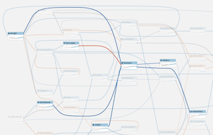
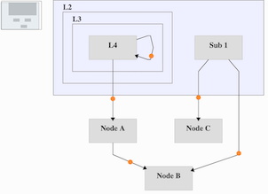

## svg-flowgraph
svg-flowgraph provides the basic scaffolding, data management, and utilities for small/medium graphs that need to be highly customizable and interactive.

svg-flowgraph is _NOT_ a layout engine, rather it expects users to provide layout-adapter implementations to transform the output into a compatible format.  We have used it for scaffolding ELK-based layouts (https://github.com/kieler/elkjs).




The example provided here uses Dagre (https://github.com/dagrejs/dagre).




### API and modules
Initialization
- el: Container element
- adapter: Adapter instance
- useEdgeControl: Whether to allocate an additional interactive element to an edge.
- useMinimap: Whether to show the mini-map
- useZoom: Whether to enable user initiated zoom/pan
- addons: List of additional modules

```
class MytRenderer extends SVGRenderer {
  ...
}

// Create renderer
const renderer = new MyRenderer({
  el: document.getElementById('test'),
  adapter: new DAGREAdapter({ nodeWidth: 100, nodeHeight: 50 }),
  renderMode: 'basic',
  useEdgeControl: true,
  useMinimap: true,
  addons: [ group, nodeSize, highlight, nodeDrag, expandCollapse, panZoom ]
});

// Run
renderer.setData(graph);
renderer.render().then(() => {
  // Call an add-on function
  renderer.enableDrag(true);
});

```

Addons
- expandCollapse: Expand/collapse nested groups
- group: Create artificial nested groups
- highlight: Gaussian blur highlights
- nodeDrag: Node dragging
- nodeSize: Node resizing
- panZoom: Programmatic navigation


### Data structure
The expected data structure has a recursive node structure, with all the edges specified at the top level.

Node objects must have these following attributes
- id
- label

Edge objects shouls have
- id
- source
- target

svg-flowgraph expects the following node attributes to be generated by the adapter
- x
- y
- width
- height

svg-flowgraph expects the following edge attributes to be generated by the adapter
- points


### Build
Build into dist
```
npm run build
```

### Test/Demo
```
npm run dev
```
